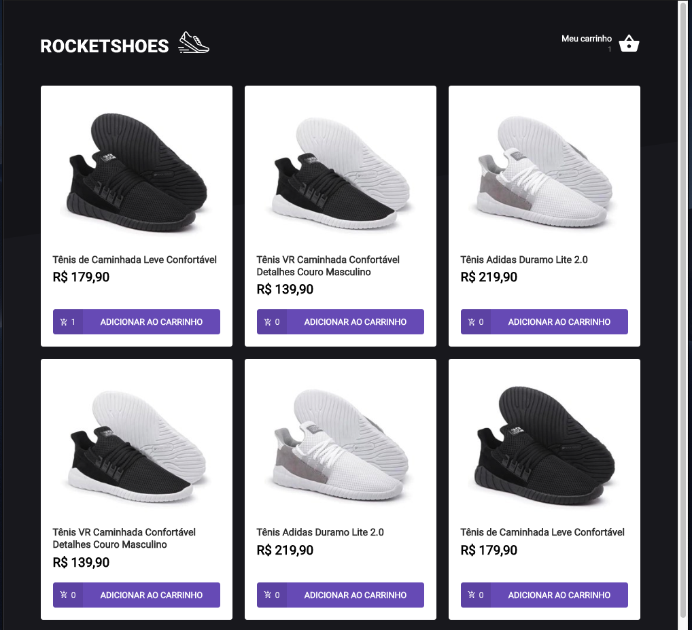
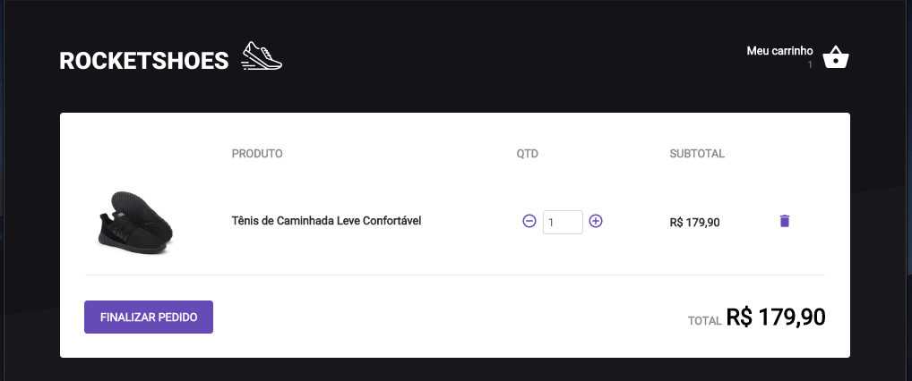

<h1 align="center">bootcamp-ReactJS-RocketShoes</h1>

 - This app was developed during the course of RocketSeat using react-native.

 - This aplication was develop in course of RocketSeat, with porpuse of demonstraing the use of Arctecture Flux.

## 💻  A simple page

 - Listing all products of the api local;

<p align="center">

</p>

 - Show list of the products in Cart;

<p align="center">

</p>


## 🎩 How it works

 - Install dependêncies
```sh
yarn
```
 - Run the API local
```sh
json-server server.json -p 3333
```
 - Run the project
```sh
yarn start
```
 - The project will run in
```sh
http://localhost:3000/
```
